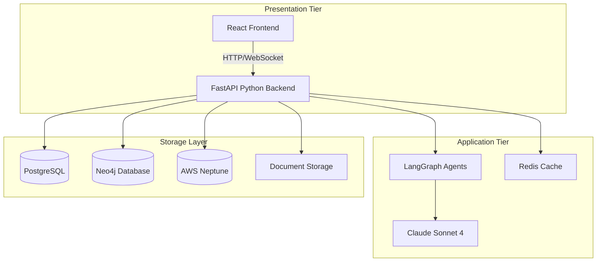

# DeepInsight

> **LLM-Powered Document Analysis & Ontology Extraction System**

DeepInsight is an advanced AI system that transforms unstructured documents into structured knowledge graphs using customizable ontologies. Built with LangGraph agents and modern web technologies, it provides an intuitive interface for document analysis, ontology management, and data extraction for graph databases.

[](https://opensource.org/licenses/MIT)
[](https://python.org)
[](https://react.dev)
[](https://fastapi.tiangolo.com)
[](https://langchain.com/langgraph)

## 🎯 Overview

### What is DeepInsight?

DeepInsight leverages state-of-the-art Large Language Models (LLMs) to extract meaningful relationships and entities from unstructured documents, creating structured ontologies and knowledge graphs that can be imported into popular graph databases like Neo4j and AWS Neptune.

### Key Capabilities

- **🤖 AI-Powered Ontology Creation**: Automatically generate ontologies from documents using Claude Sonnet 4
- **📊 Interactive Knowledge Graphs**: Visualize extracted data with interactive network graphs
- **🔄 Iterative Refinement**: Review, edit, and refine ontologies before data extraction
- **🗄️ Multi-Database Support**: Export to Neo4j and AWS Neptune formats
- **📱 Modern Web Interface**: Intuitive React-based UI with real-time progress tracking
- **🔐 Enterprise Security**: Comprehensive security framework with audit logging
- **⚡ High Performance**: Async processing with background task queues

---

## 🏗️ Architecture

### Two-Tier Architecture



### Technology Stack

#### Frontend
- **Framework**: React 18+ with TypeScript
- **UI Library**: Material-UI (MUI) v5
- **State Management**: Zustand + TanStack Query
- **Visualization**: vis.js Network
- **Build Tool**: Vite

#### Backend
- **Framework**: FastAPI with Python 3.11+
- **AI Engine**: LangGraph + LangChain
- **LLM**: Claude Sonnet 4 (configurable)
- **Database**: PostgreSQL with async SQLAlchemy
- **Cache**: Redis
- **Background Tasks**: Celery

#### Infrastructure
- **Containerization**: Docker & Docker Compose
- **Deployment**: Heroku, AWS, or self-hosted
- **Monitoring**: Structured logging + Prometheus metrics
- **Security**: JWT authentication, encryption at rest/transit

---

## 🚀 Quick Start

### Prerequisites

- **Node.js** 18.0+
- **Python** 3.11+
- **Docker** 24.0+
- **Git** 2.40+

### Installation

1. **Clone the repository**
   ```bash
   git clone https://github.com/skarlekar/deepinsight.git
   cd deepinsight
   ```

2. **Run the setup script**
   ```bash
   chmod +x scripts/setup-dev.sh
   ./scripts/setup-dev.sh
   ```

3. **Configure environment variables**
   ```bash
   # Backend configuration
   cp backend/.env.example backend/.env
   
   # Add your API keys
   echo "ANTHROPIC_API_KEY=your_key_here" >> backend/.env
   
   # Frontend configuration  
   cp frontend/.env.example frontend/.env
   ```

4. **Start the development environment**
   ```bash
   ./scripts/dev-server.sh
   ```

5. **Access the application**
   - **Frontend**: http://localhost:3000
   - **API Docs**: http://localhost:8000/docs
   - **Health Check**: http://localhost:8000/health

---

## 📖 User Guide

### Workflow Overview

DeepInsight follows a two-phase approach:

#### Phase 1: Ontology Creation
1. **Upload Document** - Support for PDF, DOCX, TXT files
2. **Generate Ontology** - AI analyzes document structure
3. **Review & Edit** - Refine extracted entities and relationships
4. **Save Ontology** - Store for reuse across documents

#### Phase 2: Data Extraction
1. **Select Ontology** - Choose from saved ontologies
2. **Configure Extraction** - Set parameters (chunk size, confidence)
3. **Extract Data** - AI processes document using ontology
4. **Visualize Results** - Interactive graph visualization
5. **Export Data** - Download for Neo4j or Neptune

### Document Types Supported

| Format | Extension | Max Size | Notes |
|--------|-----------|----------|--------|
| PDF | `.pdf` | 100MB | Text extraction via PyPDF2 |
| Word | `.docx` | 100MB | Modern Office format |
| Text | `.txt` | 50MB | Plain text documents |
| Markdown | `.md` | 50MB | Structured text format |

### Ontology Structure

Ontologies in DeepInsight follow the **subject-predicate-object** triple format:

```json
{
  "subject": {
    "entity_type": "Person",
    "type_variations": ["Employee", "Individual"],
    "primitive_type": "string"
  },
  "relationship": {
    "relationship_type": "works_for",
    "type_variations": ["employed_by", "works_at"]
  },
  "object": {
    "entity_type": "Organization", 
    "type_variations": ["Company", "Employer"],
    "primitive_type": "string"
  }
}
```

### Export Formats

#### Neo4j Format
- **Nodes CSV**: Entity data with properties and labels
- **Relationships CSV**: Connections with properties and types
- **Import Command**: `LOAD CSV WITH HEADERS FROM 'file:///nodes.csv'`

#### AWS Neptune Format  
- **Vertices CSV**: Gremlin-compatible vertex format
- **Edges CSV**: Gremlin-compatible edge format
- **Bulk Loader**: Compatible with Neptune Bulk Loader

---

## 🛠️ Development

### Project Structure

```
deepinsight/
├── backend/                    # Python FastAPI backend
│   ├── app/
│   │   ├── agents/            # LangGraph agents
│   │   ├── api/               # API endpoints
│   │   ├── core/              # Core utilities
│   │   ├── models/            # Database models
│   │   ├── schemas/           # Pydantic schemas
│   │   ├── services/          # Business logic
│   │   └── utils/             # Utilities
│   ├── tests/                 # Test suite
│   └── requirements.txt       # Python dependencies
├── frontend/                   # React frontend
│   ├── src/
│   │   ├── components/        # React components
│   │   ├── hooks/             # Custom hooks
│   │   ├── services/          # API services
│   │   ├── types/             # TypeScript types
│   │   └── utils/             # Utilities
│   ├── tests/                 # Test suite
│   └── package.json           # Node dependencies
├── docs/                       # Documentation
│   ├── system-design-architecture.md
│   ├── frontend-technical-requirements.md
│   ├── backend-technical-requirements.md
│   ├── testing-specifications.md
│   ├── security-requirements.md
│   ├── devops-requirements.md
│   ├── requirements-reviewer.md
│   └── developer-guidelines.md
├── scripts/                    # Development scripts
│   ├── setup-dev.sh
│   ├── dev-server.sh
│   └── deploy-heroku.sh
└── docker-compose.yml          # Development environment
```

### Development Commands

```bash
# Backend development
cd backend
source venv/bin/activate
uvicorn app.main:app --reload

# Frontend development  
cd frontend
npm run dev

# Run tests
npm run test              # Frontend tests
pytest                   # Backend tests

# Code quality
npm run lint             # Frontend linting
black . && isort .       # Backend formatting
mypy app/                # Type checking

# Database operations
alembic revision --autogenerate -m "description"
alembic upgrade head
```

### Testing Strategy

- **Unit Tests**: 80%+ coverage for backend, 75%+ for frontend
- **Integration Tests**: API endpoints and database operations
- **End-to-End Tests**: Critical user journeys with Playwright
- **Performance Tests**: Load testing with realistic data

### Contributing

1. **Fork the repository**
2. **Create feature branch**: `git checkout -b feature/amazing-feature`
3. **Write tests**: Ensure good coverage for new functionality
4. **Run quality checks**: `npm run lint && pytest`
5. **Commit changes**: `git commit -m 'Add amazing feature'`
6. **Push to branch**: `git push origin feature/amazing-feature`
7. **Open Pull Request**: Describe changes and link issues

---

## 🔒 Security

### Security Features

- **🔐 Authentication**: JWT-based with refresh tokens
- **🛡️ Authorization**: Role-based access control (RBAC)
- **🔒 Encryption**: AES-256 for sensitive data at rest
- **🌐 Transport Security**: TLS 1.3 for all communications
- **📊 Audit Logging**: Comprehensive security event tracking
- **⚡ Rate Limiting**: API protection against abuse
- **🔍 Input Validation**: Comprehensive sanitization

### Data Protection

- **File Upload Security**: Type validation, malware scanning
- **SQL Injection Protection**: Parameterized queries only
- **XSS Prevention**: Content Security Policy headers
- **CSRF Protection**: Double-submit cookie pattern
- **Session Management**: Secure session handling with Redis

### Compliance

- **GDPR**: Data minimization, right to erasure
- **OWASP Top 10**: All vulnerabilities addressed
- **SOC 2**: Security and availability controls
- **ISO 27001**: Information security standards

---

## 🚀 Deployment

### Local Development

```bash
# Using Docker Compose
docker-compose up -d

# Manual setup
./scripts/setup-dev.sh
./scripts/dev-server.sh
```

### Production Deployment

#### Heroku (Recommended)

```bash
# One-time setup
heroku create your-app-name
heroku addons:create heroku-postgresql:essential-0
heroku addons:create heroku-redis:mini

# Deploy
git push heroku main

# Configure environment
heroku config:set ANTHROPIC_API_KEY=your_key
heroku config:set SECRET_KEY=$(openssl rand -base64 32)
```

#### Docker Self-Hosted

```bash
# Build images
docker build -t deepinsight-backend backend/
docker build -t deepinsight-frontend frontend/

# Deploy with compose
docker-compose -f docker-compose.prod.yml up -d
```

#### AWS/GCP

- Use provided Terraform configurations
- Deploy via container services (ECS, Cloud Run)
- Configure managed databases and caching

### Environment Variables

#### Required
```bash
# Backend
SECRET_KEY=your-secret-key
DATABASE_URL=postgresql://...
ANTHROPIC_API_KEY=your-anthropic-key

# Optional
OPENAI_API_KEY=your-openai-key
REDIS_URL=redis://...
NEO4J_URI=bolt://...
NEPTUNE_ENDPOINT=your-cluster...
```

#### Optional
```bash
# Performance
MAX_CONCURRENT_EXTRACTIONS=3
DEFAULT_CHUNK_SIZE=1000
CELERY_BROKER_URL=redis://...

# Security
REQUIRE_HTTPS=true
SESSION_TIMEOUT_HOURS=8
MAX_LOGIN_ATTEMPTS=5
```

---

## 📊 Performance & Scaling

### Performance Metrics

- **Document Processing**: 1-10 minutes per document (varies by size/complexity)
- **API Response Time**: < 200ms for standard operations
- **Concurrent Users**: 100+ supported with default configuration
- **File Upload**: Up to 100MB per document
- **Memory Usage**: ~500MB base, +100MB per active extraction

### Scaling Recommendations

#### Horizontal Scaling
- **Backend**: Multiple FastAPI instances behind load balancer
- **Database**: Read replicas for query scaling
- **Cache**: Redis Cluster for high availability
- **Background Jobs**: Multiple Celery workers

#### Performance Optimization
- **Caching**: Redis for frequent queries and LLM responses
- **Database**: Proper indexing and query optimization  
- **File Processing**: Async operations with progress tracking
- **Frontend**: Code splitting and lazy loading

### Resource Requirements

#### Development
- **CPU**: 2+ cores
- **Memory**: 8GB RAM
- **Storage**: 20GB available space
- **Network**: Reliable internet for LLM API calls

#### Production (per instance)
- **CPU**: 4+ cores
- **Memory**: 16GB RAM
- **Storage**: 100GB+ (document storage)
- **Database**: Separate PostgreSQL instance
- **Cache**: Redis with persistence

---

## 📚 API Reference

### Core Endpoints

#### Authentication
```http
POST /api/v1/auth/login
POST /api/v1/auth/refresh
POST /api/v1/auth/logout
```

#### Documents
```http
POST /api/v1/documents/upload
GET  /api/v1/documents
GET  /api/v1/documents/{id}
DELETE /api/v1/documents/{id}
```

#### Ontologies
```http
POST /api/v1/ontologies/generate
GET  /api/v1/ontologies
PUT  /api/v1/ontologies/{id}
DELETE /api/v1/ontologies/{id}
GET  /api/v1/ontologies/{id}/export
```

#### Extractions
```http
POST /api/v1/extractions/start
GET  /api/v1/extractions/{id}/status
GET  /api/v1/extractions/{id}/results
POST /api/v1/extractions/{id}/cancel
```

#### Database Integration
```http
POST /api/v1/databases/test-connection
POST /api/v1/databases/import
GET  /api/v1/databases/export/{format}
```

### WebSocket Events

- **Progress Updates**: Real-time extraction progress
- **Status Changes**: Document processing status
- **Notifications**: System alerts and messages

### Response Formats

All API responses follow this structure:

```json
{
  "success": true,
  "data": {...},
  "message": "Operation completed successfully",
  "timestamp": "2025-01-01T00:00:00Z"
}
```

Error responses:

```json
{
  "success": false,
  "error": {
    "code": "VALIDATION_ERROR",
    "message": "Invalid input data",
    "details": {...}
  },
  "timestamp": "2025-01-01T00:00:00Z"
}
```

---

## 🤝 Support & Community

### Getting Help

- **📖 Documentation**: Comprehensive guides in `/docs`
- **🐛 Bug Reports**: [GitHub Issues](https://github.com/skarlekar/deepinsight/issues)
- **💡 Feature Requests**: [GitHub Discussions](https://github.com/skarlekar/deepinsight/discussions)
- **💬 Community**: Join our Discord server
- **📧 Enterprise Support**: Contact team@deepinsight.ai

### FAQ

**Q: What document formats are supported?**
A: PDF, DOCX, TXT, and MD files up to 100MB.

**Q: Which LLMs can I use?**
A: Claude Sonnet 4 (default), OpenAI GPT-4, or any LangChain-compatible LLM.

**Q: Can I self-host DeepInsight?**
A: Yes, full Docker support and self-hosting documentation provided.

**Q: Is my data secure?**
A: Yes, end-to-end encryption, audit logging, and enterprise security standards.

**Q: How accurate is the extraction?**
A: Accuracy varies by document complexity, typically 85-95% for well-structured documents.

### Roadmap

- **v1.1**: Multi-language document support
- **v1.2**: Collaborative ontology editing
- **v1.3**: Advanced analytics dashboard
- **v2.0**: Custom LLM integration
- **v2.1**: Workflow automation
- **v3.0**: Enterprise SSO integration

---

## 📄 License

This project is licensed under the MIT License - see the [LICENSE](LICENSE) file for details.

```
MIT License

Copyright (c) 2025 Srini Karlekar

Permission is hereby granted, free of charge, to any person obtaining a copy
of this software and associated documentation files (the "Software"), to deal
in the Software without restriction, including without limitation the rights
to use, copy, modify, merge, publish, distribute, sublicense, and/or sell
copies of the Software, and to permit persons to whom the Software is
furnished to do so, subject to the following conditions:

The above copyright notice and this permission notice shall be included in all
copies or substantial portions of the Software.

THE SOFTWARE IS PROVIDED "AS IS", WITHOUT WARRANTY OF ANY KIND, EXPRESS OR
IMPLIED, INCLUDING BUT NOT LIMITED TO THE WARRANTIES OF MERCHANTABILITY,
FITNESS FOR A PARTICULAR PURPOSE AND NONINFRINGEMENT. IN NO EVENT SHALL THE
AUTHORS OR COPYRIGHT HOLDERS BE LIABLE FOR ANY CLAIM, DAMAGES OR OTHER
LIABILITY, WHETHER IN AN ACTION OF CONTRACT, TORT OR OTHERWISE, ARISING FROM,
OUT OF OR IN CONNECTION WITH THE SOFTWARE OR THE USE OR OTHER DEALINGS IN THE
SOFTWARE.
```

---

## 🙏 Acknowledgments

- **LangChain Team**: For the excellent LLM framework
- **Anthropic**: For Claude Sonnet 4 API
- **FastAPI**: For the high-performance Python framework
- **React Community**: For the robust frontend ecosystem
- **Neo4j & AWS**: For graph database technologies

---

*Built with ❤️ by the DeepInsight team*

**Ready to transform your documents into knowledge graphs?** [Get started now!](#-quick-start)