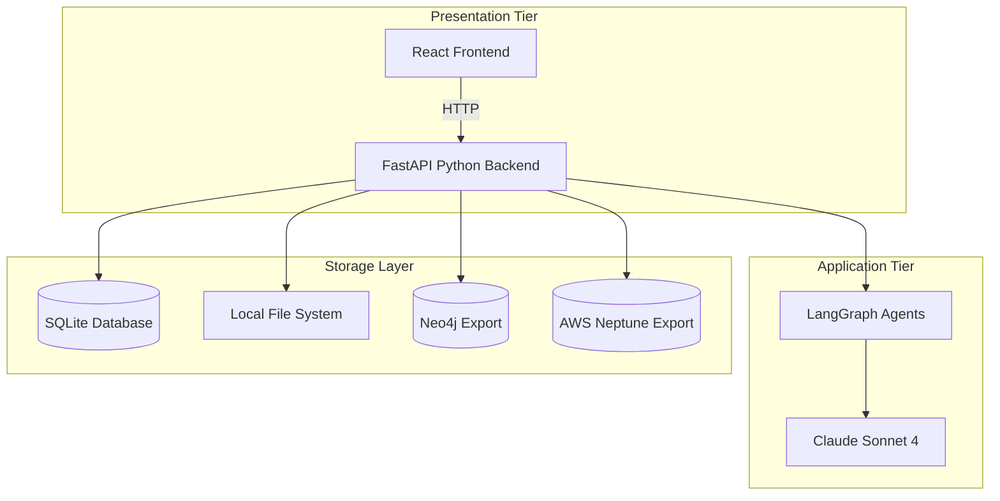
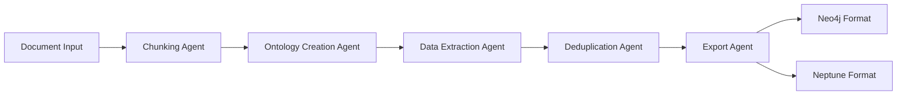
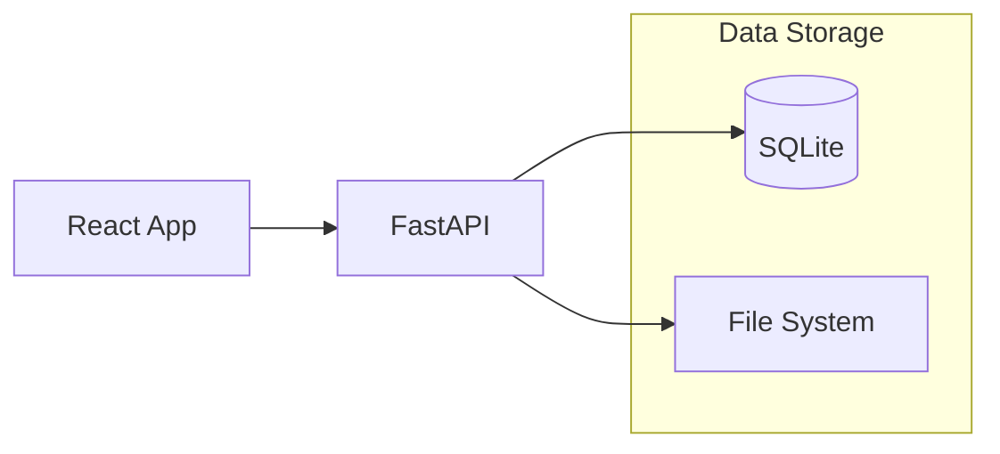

# DeepInsight System Design & Architecture

## Overview

DeepInsight is an LLM-based agentic AI system designed to extract structured information from unstructured documents using customizable ontologies. The extracted data is formatted for loading into graph databases (Neo4j and AWS Neptune).

## System Architecture

### Simplified MVP Two-Tier Architecture



## Component Architecture

### 1. Frontend (React Application)
- **Technology Stack**: React 18+, TypeScript, Material-UI
- **Key Components**:
  - Document Upload Manager with drag-and-drop
  - Interactive Ontology Editor with CRUD operations
  - Network Graph Visualization (vis.js)
  - Database Connection Manager
  - Real-time Progress Dashboard
  - WebSocket Communication Handler
  - Error Boundary Components
  - Mobile-responsive Design

### 2. Backend (FastAPI Python)
- **Architecture Pattern**: Service-oriented with LangGraph Agents
- **Core Services**:
  - Document Processing Service
  - Ontology Management Service
  - Data Extraction Service
  - Database Export Service
  - LLM Integration Service
  - Authentication & Authorization Service
  - WebSocket Communication Service

#### Agent Architecture (LangGraph)



## Data Flow Architecture

### Ontology Creation Flow
1. **Document Upload** → Secure file validation and storage
2. **Document Processing** → Text extraction with metadata
3. **Intelligent Chunking** → Overlapping chunks for context preservation
4. **Entity/Relationship Extraction** → LLM identifies patterns per chunk
5. **Advanced Deduplication** → Semantic similarity matching
6. **Ontology Generation** → Structured JSON schema creation
7. **User Review Interface** → Interactive editing and refinement

### Data Extraction Flow
1. **Ontology Selection** → User-approved ontology loaded
2. **Document Re-chunking** → Optimized chunking for extraction
3. **Guided Extraction** → LLMGraphTransformer with ontology constraints
4. **Location Mapping** → Precise document position tracking
5. **Multi-pass Processing** → Iterative extraction for completeness
6. **Intelligent Deduplication** → Graph-aware duplicate removal
7. **Multi-format Export** → Neo4j and Neptune CSV generation

## Technology Stack

### Frontend
- **Framework**: React 18+ with TypeScript
- **UI Library**: Material-UI (MUI) v5
- **State Management**: Zustand + TanStack Query
- **Visualization**: vis.js Network
- **Build Tool**: Vite
- **Testing**: Vitest, React Testing Library, Playwright
- **WebSocket**: Native WebSocket API with reconnection

### Backend (MVP Simplified)
- **Framework**: FastAPI with Python 3.11+
- **Agent Framework**: LangGraph
- **LLM Integration**: Direct Anthropic Claude integration
- **Data Processing**: LangChain LLMGraphTransformer
- **Validation**: Pydantic v2
- **Database**: SQLite with simple sync operations
- **File Storage**: Local file system
- **Testing**: pytest with basic fixtures

### Infrastructure (MVP Simplified)
- **Containerization**: Docker & Docker Compose
- **Deployment**: Single server (Heroku, DigitalOcean, or self-hosted)
- **Database**: SQLite single file
- **Storage**: Local filesystem with basic security
- **Monitoring**: Simple application logging
- **No Load Balancing**: Single server deployment

## Database Strategy (MVP Simplified)

### Primary Application Database
- **SQLite**: Single-file database for all application data
- **File System**: Document storage, ontologies, and extraction results
- **No Caching**: Direct database access for simplicity

### Export Target Databases
- **Neo4j**: Generate CSV files for import
- **AWS Neptune**: Generate CSV files for bulk loading

### Simple Storage Architecture



### Storage Strategy
- **SQLite**: User accounts, document metadata, processing status
- **JSON Files**: Ontologies and extraction results
- **File System**: Uploaded documents organized by user
- **No Caching**: Direct file and database access

## Performance & Scalability (MVP Simplified)

### No Horizontal Scaling Needed
- **Single Server**: Sufficient for <5 users
- **Single Database**: SQLite handles the load
- **No Load Balancing**: Direct server access
- **Simple Deployment**: One container or server instance

### Basic Performance Optimization
- **Synchronous Processing**: Simpler implementation for MVP
- **Direct File Access**: No complex storage layers
- **Basic LLM Usage**: Direct API calls to Claude
- **Simple UI Loading**: Standard React performance patterns

## Error Recovery & Resilience (MVP Simplified)

### Basic Error Handling
- **Simple Retries**: Basic retry logic for LLM API calls
- **File Validation**: Check file types and sizes before processing
- **Basic Error Messages**: User-friendly error notifications

### Backup & Recovery (Simplified)
- **Database**: Manual backup of SQLite file
- **Documents**: File system backup of data directory
- **No Complex Recovery**: Simple file restoration process

### Basic Health Monitoring
- **Application Health**: Simple /health endpoint
- **Basic Logging**: Application logs to files
- **Manual Monitoring**: Visual inspection of logs and system status

## Security Architecture (MVP Simplified)

### Basic Security
- **Transport Security**: HTTPS for all communications
- **Authentication**: Simple JWT tokens
- **Authorization**: User-based access only
- **Data Protection**: Basic file permissions
- **Input Validation**: Pydantic validation with basic sanitization

### API Security (Simplified)
- **Basic Rate Limiting**: Simple per-user counters
- **CORS Policy**: Basic cross-origin settings
- **File Validation**: Check file types and sizes
- **Basic API Security**: Standard FastAPI security practices

## Deployment Architecture

### Development Environment
```
localhost:3000 (React) ↔ localhost:8000 (FastAPI)
                        ↓
                SQLite + File Storage
```

### Production Environment
```
Static React App ↔ Single FastAPI Server ↔ SQLite + Files
```

### Environment Strategy (Simplified)
- **Development**: Docker Compose with hot reload
- **Production**: Single server deployment (Heroku/DigitalOcean)
- **No Staging**: Direct development to production for MVP

## Communication (MVP Simplified)

### HTTP-Only Communication
- **Standard REST API**: No WebSocket complexity for MVP
- **Polling for Status**: Frontend polls backend for processing status
- **Simple Progress**: Basic status indicators without real-time updates
- **Error Handling**: Standard HTTP error responses

## Data Models

### Core Entities (MVP Simplified)
```python
# Simple data model for MVP
Users → Documents → Ontologies → Extractions
  ↓         ↓           ↓           ↓
Basic    Metadata    JSON       Results
Info     + Status    Files      + CSVs
```

### Relationship Mapping (Simplified)
- **Users**: Basic authentication and file ownership
- **Documents**: File metadata and processing status
- **Ontologies**: JSON files with simple versioning
- **Extractions**: Results stored as JSON + CSV exports

This simplified MVP architecture eliminates enterprise complexity while providing core functionality for <5 users. Direct React-to-FastAPI communication with SQLite and file storage provides a working system that can be enhanced later.